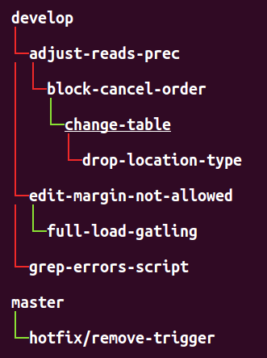
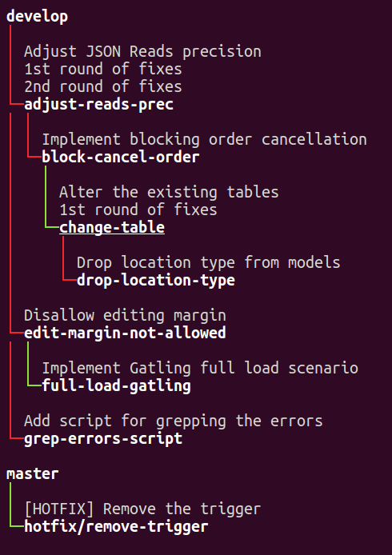

Title: Make your way through git (rebase) jungle with `git-machete`!

TODO: use some jungle-related picture

TL;DR: `git machete` helps you see what topic branches are out of sync with their parent (upstream) branches and automatically rebase them, especially when some of them are stacked atop other ones.
It's mostly applicable for the git users who work with rebase flow (as opposed to merge-based flows).

# The problem

Let's imagine the following real-life _git jungle_ situation.

You implemented a fix on a branch `adjust-reads-prec` and made a pull request to `develop`.
While the PR was under review, you already started work on another topic branch `block-cancel-order`.
Unfortunately, the changes that you were to introduce on `block-cancel-order` depended on what was already done on `adjust-reads-prec`...
So you forked the new branch off `adjust-reads-prec` and when the change was ready, you made another PR, this time for `block-cancel-order` to `adjust-reads-prec`.
In the meantime, the reviewers posted their fixes on the first PR.
You applied their remarks as `1st round of fixes` on the `adjust-reads-prec` branch.
Since the review process took some time, you managed to start a couple of new refactors and bugfixes (say, on branches `change-table` and `drop-location-type`),
but since each of them was dependent on the changes already waiting in review queue, you began stacking branches on top of each other.
So we ended up with a couple of branches each was dependent on a previous one: `adjust-reads-prec`, `block-cancel-order`, `change-table` and `drop-location-type`.

Now for the sake of providing a full-fledged example let's include a couple of other branches in our scenario.
Other than the already mentioned 4 branch chain, you also independently developed a feature `edit-margin-not-allowed` and later derived a branch `full-load-gatling` from that point.
Also, you had a lonely branch `grep-errors-script` that (fortunately!) nothing depended on, and a `hotfix/remove-trigger` branch, this time on the top of `master`, not `develop`.

Now the problem -- how to quickly check now which of our branches are in sync with their parent (aka upstream) branches, which could be simply `develop` or `master`, but also another topic branch?
And also, how to easily rebase each of branches on the top of its parent, especially after dependencies between branches change from we just described?


# Defining a structure for the branches (`edit` command)


Okey, let's get our hands dirty... first install `git-machete` with a `curl` one-liner that you can find at [the git machete repo](https://github.com/PawelLipski/git-machete).
This will copy the `git-machete` Python 2.7 executable to `/usr/local/bin` and set up a corresponding Bash completion script in `/etc/bash_completion.d`.

Once we have `git-machete` in our executable `PATH` (and thus have git recognize the `machete` subcommand), let's first specify how we would like to organize our branches - basically, what depends on what.
Run `git machete edit` or simply open the `.git/machete` file with your favorite editor.
Paste the following branch tree definition:
```
develop
    adjust-reads-prec
        block-cancel-order
            change-table
                drop-location-type
    edit-margin-not-allowed
        full-load-gatling
    grep-errors-script
master
    hotfix/remove-trigger
```

The above content defines a tree-like structure where `develop`/`master` are the roots, `adjust-reads-prec` depends directly on `develop` branch,
`block-cancel-order` depends directly on `adjust-reads-prec` and thus also (indirectly) on `develop` and so on - just as we defined it verbally in the previous paragraph.
Tip: don't worry if the tabs got converted into spaces during copy-paste - it's okey to use any kind of indent as long as you use consistently.

Now we've given defined the structure how our branches should relate to each other.
??????? TODO rephrase !!!!!!! That's unfortunately so far not really how branches in our current state of the repository look like.
For example, a few pull requests from other team members were merged into `develop` in the meantime,
so `adjust-reads-prec`, `edit-margin-not-allowed` and `grep-errors-script` now need to be synced with `develop` (possibly we'll have to solve some conflicts during the rebase, but that's irrelevant for our discussion).
Also, our PRs for `adjust-reads-prec` and `change-table` received a couple of comments which we then fixed on a separate commit...
thus throwing `block-cancel-order` and `drop-location-type`, respectively, out of sync with their upstream branches.
And... that's exactly a _jungle_ like that where `git machete` comes to rescue.


# What's macheting really about... `status`, `go` and `update` subcommands


Let's now run `git machete status` to see the actual current state of which branches are synced with their upstreams and which ones are not:



Now we see the branch tree with coloring of edges.
Red edge leading to a child/downstream branch means that this branch is out of sync with its parent/upstream branch (not a direct descendant in commit graph) and needs to be rebased onto the parent.
Green edge means that the downstream branch remains in sync with the parent.
`change-table` is underlined since it's the currently checked out branch.

This leads to a somewhat daunting conclusion that only 3 (`change-table`, `full-load-gatling` and `hotfix/remove-trigger`) out of our 8 topic branches are synced with their upstreams branches... but fear not!
We'll get it sorted soon.

But before we do, let's run `git machete status --list-commits` (or `git machete s -l` for short) to prints the commits introduced on each branch:



An important and somewhat non-trivial note here: what you see here for each commit is actually the part of branches history that's unique to this branch -
i.e. `git machete status` only lists the commits that where most likely introduced on this very branch.
To determine this piece of history, `git machete` finds a _fork point_ which can be loosely defined as the commit at which the history of the branch actually diverges from the history of any other branch.
Then, `status --list-commits` lists everything that follows after the fork point.
Finding this special place in history is more difficult than it could seem at first glance... look at [the section below](#appendix-fork-point---not-so-easy-business) below if you are interested in more details.

Let's now check out `adjust-reads-prec` and put it back in sync with `develop`.
We'll first use a handy subcommand `git machete go <direction>` that helps navigate the tree by checking out a branch specified by direction (`up` in this case, can also be `down`, `next`, `prev` and `root`).
Then we'll do the actual rebase (with automagically set up parameters, no need to worry about the super-unintuitive `git rebase` CLI!) by `git machete update`.


We didn't include that on the above screencast, but in the meantime git displayed a TODO list for the interactive rebase that listed the 3 commits that were about to be moved onto `develop`.
We could do all the actions allowed during an interactive rebase, like squashing commits, editing the commit messages etc. and of course we could even cancel the entire operation by clearing the TODO lists.


Now let's see the status:


`adjust-reads-prec` is now in sync with `develop`!

Unfortunately, the logical consequence is now that the downstream branch `block-cancel-order` now diverged from `adjust-reads-prec`'s commit history...
but wait, what prevents us from applying an `update` to othere branches one by one as well?

Let's go down the git jungle (with a handy shortcut `git machete go down`) and rebase the downstream branches one by one onto their already rebased parents:


??? TODO zmiana drzewa, pokazac ze wszystko ladnie hula!

For the sake of simplicity we didn't include it in the above section, but if we had a corresponding remote repository,
`git machete status` will also print out a `(out of sync with origin)` annotation next to the branches that are not synced with their remote counterparts and need to be pushed
(possible a push with `--force`, especially if they were rebased).
Note that this _remote-syncness_ is completely independent from their _parent-syncness_ - a branch can be in sync with the remote counterpart but not with the local parent/upstream branch, and vice versa.


# A few other useful hacks... `diff`, `add`, `reapply` and `slide-out`


To see the changes introduced since the fork point of the current branch, run `git machete diff`.

`git machete go` helps quickly navigate between branches in the tree.
`git machete go up` and `git machete go down` check out the upstream branch or downstream branch of the current branch (if defined).
`git machete go root` goes all the way upstream to the root of the tree (where a `develop` or `master` branch is usually located).
`git machete go prev` and `git machete go next` switch to the previous or next branch in the order of definition (or simply just previous/next line in the ladder definition file).

`git machete add --onto [<target-upstream>] [<branch>]` pushes the branch ???
Let's now add a newly created branch `ignore-whitespace` onto the existing branch `change-table` and see the status:

TODO shell + status now!

The same effect can as well be achieved by editing the definition file `.git/machete` manually e.g. with `git machete edit`.


`reapply` is similar to `update`, but instead of rebasing the commits onto upstream branch, it instead rebases onto fork point.
This means that rebase changes nothing in relation to the upstream branch - if the branches weren't in sync before, they still won't be.


`slide-out` subcommand comes somewhat tricky.
Let's assume the `a???` was already merged to develop.
What we most likely want to do now is to remove `edit-margin-not-allowed` from the tree and then rebase its downstream branch `full-load-gatling`
onto the original upstream `develop`.
Since that's a pretty common combination, there's a shortcut for that, `git machete slide-out`.
Let's check out `edit-margin-not-allowed` and run the command:

TODO pic

and then after completing the rebase we get the following tree:

TODO pic

All commands supported by `git machete` can be found under `git machete help`.
Run `git machete help <command>` for a more specific doc for the given command.


# Appendix: fork point - not so easy business...


The fork point commit (the commit at which the history of the branch actually diverges from the history of any other branch) is determined with a heuristics that uses `git reflog`.
It's generally not trivial to find a correct fork point in every case, so a heurestics is applied that compares the *commit-wise* history (aka `git log`) of the given branch
with *operation-wise* history (aka `git reflog`) of all other local branches.
Roughly speaking, the most recent commit `C` from the log of the branch `x` that also happens to appear on reflog of any other branch `y` is considered the _fork point_ of the branch `x`.
The fact that `C` was found somewhere in the reflog of `y` suggests that it was originally commited on `y` (even though it might no longer appear on `y`'s history due to e.g. rebases).

This definition, though working correctly in most real-life cases, might sometimes fail to find a _logically_ correct fork point commit.
In particular, if certain local branches were already deleted, the determined fork point may be _too early_ in the history than expected.

It's always possible to check the fork point for a given branch included in the definition file with `git machete fork-point [<branch>]`,
or to simply list commits considered by `git machete` to be specific for the each branch with `git machete status --list-commits`.

Anyway, the potentially effects of incorrectly determined fork points are mitigated in at least two ways:
* The three commands that run `git rebase` under the hood (`reapply`, `slide-out` and most notably `update`) always pass the `--interactive` flag.
  This enables the user to review the list of commits that are going to be rebased before actual rebase is executed, or even cancel the rebase by clearing out the rebase TODO list.
* It's also possible to explicitly specify the fork point for the mentioned three commands with `-f`/`--fork-point` (`reapply`, `update`) or `-d`/`--down-fork-point` (`slide-out`).

More git-savvy users may argue that it should be enough to simply use `--fork-point` option of `git rebase`... but the reality turns out to be harder.
`git merge-base --fork-point` (and thus `git rebase` with the said option) only takes reflog of the one provided upstream branch into account.
This would work fine as long as nobody changes the structure of the tree in the definition file (i.e. the upstream branch of any branch doesn't change).
Unfortunately, such tree structure modifications happen pretty often in real-life development... and thus a custom, more powerful way to find the fork point was necessary.

