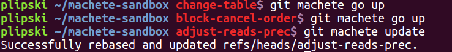
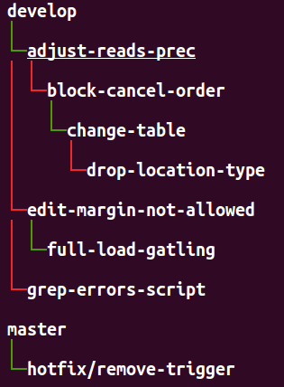
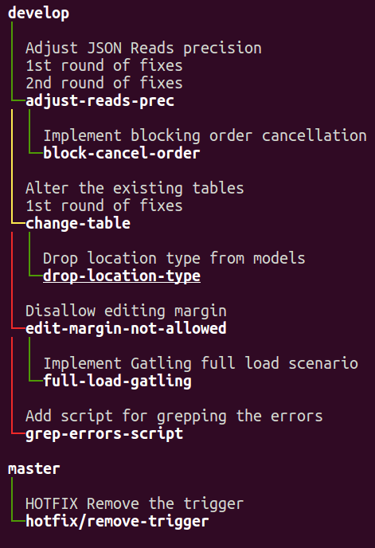

Title: Make your way through git (rebase) jungle with `git machete`!

TODO: use some jungle-related picture, like [this one](https://goo.gl/images/1i7Uqf) if copyright allows

TL;DR: `git machete` helps you see what topic branches are out of sync with their parent (upstream) branches and automatically rebase them, especially when some of them are stacked atop other ones.
It's mostly applicable for the git users who work with rebase flows (as opposed to merge-based flows).


# The problem


Let's imagine the following real-life _git jungle_ situation.

You implemented a fix on a branch `adjust-reads-prec` and made a pull request to `develop`.
While the PR was under review, you already started work on another topic branch `block-cancel-order`.
Unfortunately, the changes that you were to introduce on `block-cancel-order` depended on what was already done on `adjust-reads-prec`...
So you forked the new branch off `adjust-reads-prec` and when the change was ready, you made another PR, this time for `block-cancel-order` to `adjust-reads-prec`.
In the meantime, the reviewers posted their fixes on the first PR.
You applied their remarks as a `1st round of fixes` commit on the `adjust-reads-prec` branch.

Since the review process took some time, you managed to start a couple of new refactors and bugfixes (say, on branches `change-table` and `drop-location-type`),
but since each of them was dependent on the changes already waiting in review queue, you began stacking branches on top of each other.
So we ended up with a couple of branches, each dependent on a previous one: `adjust-reads-prec`, `block-cancel-order`, `change-table` and `drop-location-type`.

Now for the sake of providing a full-fledged example, let's include a couple of other branches in our scenario.
Other than the already mentioned 4-branch chain, you also independently developed a feature `edit-margin-not-allowed` and later derived a branch `full-load-gatling` from that point.
Also, you created a branch `grep-errors-script` that (fortunately!) nothing depended on, and a `hotfix/remove-trigger` branch, but on the top of `master`, not `develop`.

Now the problem - how to quickly check now which of our branches are in sync with their parent (aka upstream) branches, which for some is simply `develop` or `master`, but for others - some other topic branch?
And also, how to easily rebase each of branches on the top of its parent, especially after dependencies between branches change from we just described?


# Defining a structure for the branches (`edit` subcommand)


Okey, let's get our hands dirty... first install `git-machete` with a `curl` one-liner that you can find at [the git machete repo](https://github.com/PawelLipski/git-machete).
This will copy the `git-machete` Python 2.7 executable to `/usr/local/bin` and set up a corresponding Bash completion script in `/etc/bash_completion.d`.

Once we have `git-machete` in our executable `PATH` (and thus git already recognizes the `machete` subcommand), let's first specify how we like to organize our branches - basically, what depends on what.
Run `git machete edit` or simply open the `.git/machete` file with your favorite editor.
Paste the following branch tree definition:
```
develop
    adjust-reads-prec
        block-cancel-order
            change-table
                drop-location-type
    edit-margin-not-allowed
        full-load-gatling
    grep-errors-script
master
    hotfix/remove-trigger
```

The above content defines a tree-like structure where `develop`/`master` are the roots.
`adjust-reads-prec` depends directly on `develop` branch, `block-cancel-order` depends directly on `adjust-reads-prec` and thus also (indirectly) on `develop` and so on -
just as we defined it verbally earlier in the post.
Tip: don't worry if the tabs got converted into spaces during copy-paste - it's okey to use any kind of indent as long as you use consistently.

Now we've defined the structure how our branches should relate to each other.
Unfortunately, some of the branches aren't really in sync with the defined structure.
For example, a few pull requests from other team members were merged into `develop` in the meantime,
so `adjust-reads-prec`, `edit-margin-not-allowed` and `grep-errors-script` now need to be synced with `develop` (possibly we'll have to solve some conflicts during the rebase, but that's irrelevant for our discussion).
Also, our PRs for `adjust-reads-prec` and `change-table` received a couple of comments which we then fixed on a separate commit...
thus throwing `block-cancel-order` and `drop-location-type`, respectively, out of sync with their upstream branches.
And... that's exactly a _jungle_ like that where `git machete` comes to the rescue.


# What's macheting really about... `status`, `go` and `update`


Let's now run `git machete status` to see the actual current state of which branches are synced with their upstreams and which ones are not:


Now we see the branch tree with coloring of edges.
Red edge leading to a child/downstream branch means that this branch is out of sync with its parent/upstream branch (not a direct descendant in the git commit graph) and needs to be rebased onto the parent.
Green edge, on the other hand, means that the downstream branch remains in sync with the parent.
`change-table` is underlined since it's the currently checked out branch.

This leads to a somewhat disappointing conclusion that only 3 (`change-table`, `full-load-gatling` and `hotfix/remove-trigger`) out of our 8 topic branches are synced with their upstreams branches... but fear not!
We'll get it sorted soon.

But before we do, let's also run `git machete status --list-commits` (or `git machete s -l` for short) to prints the commits introduced on each branch:


An important and somewhat non-trivial note here: what you see here for each commit is actually the part of branch's history that's unique to this branch -
i.e. `git machete status` only lists the commits that where (most likely) introduced on this very branch and not on any other.
To determine this piece of commit history, `git machete` finds a _fork point_ which can be loosely defined as the commit at which the history of the branch actually diverges from the history of any other branch.
Then, `status --list-commits` lists everything that follows after the fork point.
Finding this special place in history is more difficult than it could seem at first glance... look at [the section below](#appendix-fork-point---not-so-easy-business) if you are interested in more details.

Let's now check out `adjust-reads-prec` and put it back in sync with `develop`.
We'll first use a handy subcommand `git machete go <direction>` that helps navigate the tree by checking out a branch specified by direction (`up` in this case, can also be `down`, `next`, `prev` and `root`).
Then we'll do the actual rebase (with automagically set up parameters, no need to worry about the super-unintuitive `git rebase` CLI!) by `git machete update`.



We didn't include that on the above screencast, but in the meantime git displayed a standard interactive rebase TODO list that listed the 3 commits that were about to be moved onto `develop`.
We could do all the actions allowed during an interactive rebase, like squashing commits, editing the commit messages etc. and of course we could even cancel the entire operation by clearing the said TODO list.

Now let's see the status:



`adjust-reads-prec` is now in sync with `develop`!

Unfortunately, the inevitable consequence is that the downstream branch `block-cancel-order` is now out of sync with `adjust-reads-prec`...
but wait, what prevents us from applying an `update` to the following downstream branches as well?

Let's go down the git jungle (with a handy shortcut `git machete go down`) and rebase the downstream branches one by one onto their already rebased parents:


We see that now all the 4 branches in the longest chain are synced to each other and to develop.
In fact, we can also see the commit history with a graphic tool (here we use TUI-ish `tig`, but it could as well be `gitk`, `gitg` or IntelliJ's CVS tools) to confirm that all branches are neatly lined up.


As a cherry on the top - let's now assume somebody on the team says they need to merge the `change-table` branch as soon as possible
and they can't wait before `adjust-reads-prec` and `block-cancel-order` pass the review and get merged first.
You're not very willing to do so since the two mentioned upstream branches introduced some nice helpers than you later used in `change-table`... but you're basically left with no choice.
To make the process as painless as possible, let's modify the definition file with `git ladder edit`:

```
develop
    adjust-reads-prec
        block-cancel-order
	change-table
		drop-location-type
    edit-margin-not-allowed
        full-load-gatling
    grep-errors-script
master
    hotfix/remove-trigger
```



Once we modified the definition file, `git machete status` marked the edge between `develop` and `change-table` as yellow.
This means that the downstream branch (`change-table`) is still in sync with the upstream (`develop`), but the upstream branch tip isn't the fork point of the downstream branch.
Translating from _git-ese_ to English, there are probably some other branches on the way between `develop` and `change-table`... and that's exactly the case now.
You won't come across the yellow edges very often in day-to-day work with `git machete` - it mostly happens when the tree structure has been surgically modified like we just did a moment ago.

Anyway, since the edge is not green, you should now run `git machete update` to rebase `change-table` directly onto `develop`.
Most likely you'll need to resolve the conflicts (since you're now basically trying to skip the commits introduced by `adjust-reads-prec` and `block-cancel-order` from the history of `change-table`)
and you'll surely need to update `drop-location-type` onto `change-table`... but anyway, all it takes is just two `git machete update`s instead of complicated `git rebase`s with 3 parameters!

For the sake of simplicity we didn't mention it in the above section, but if we had a corresponding remote repository,
`git machete status` will also print out a `(out of sync with origin)` annotation next to the branches that are not synced with their remote counterparts.
They most likely need to be pushed to the remote at some point (possible with `--force`, in particular if they were rebased since the last push).
Note that this notion of _remote-syncness_ is completely orthogonal to their _parent-syncness_ - a branch can be in sync with the remote counterpart but not with the local parent/upstream branch, and vice versa.
Also, to be considered in sync with remote, branch must be _commit-wise equal_ to the remote counterpart, while for parent-syncness it's enough for branch commit to be a _direct descendant_ of the parent branch commit.


# A few other useful hacks... `diff`, `add`, `reapply` and `slide-out`

To see the changes introduced on the current branch, run `git machete diff`.
This will compare the current working directory to the fork point commit of the current branch.
You can also provide a branch parameter (`git machete diff <branch>`) to see the diff of the given branch against its fork point.

`git machete add [--onto=<target-upstream>] [<branch>]` adds the specified branch (or the current one, if skipped) onto the given target upstream branch.
The same effect can as well be achieved by editing the definition file `.git/machete` manually e.g. with `git machete edit`.
For example, if we run `git branch ignore-whitespace` and then `git machete add --onto=block-cancel-order ignore-whitespace`, we'll end up with the following definition file:

```
develop
    adjust-reads-prec
        block-cancel-order
			ignore-whitespace
	change-table
		drop-location-type
    edit-margin-not-allowed
        full-load-gatling
    grep-errors-script
master
    hotfix/remove-trigger
```

`reapply` is similar to `update`, but instead of rebasing the commits onto the upstream branch, it instead (also interactively) rebases them onto fork point of the current branch.
This means that the rebase operaion will change nothing in relation to the upstream branch - if the branches weren't in sync before, they still won't be.
The main use of `reapply` is squashing or otherwise reorganizing the commits _within the current branch_ rather than moving those commits _onto the upstream branch_ (as `update` does).

`slide-out` subcommand, in turn, is somewhat tricky.
Let's assume the `edit-margin-not-allowed` branch was already merged to develop and we no longer need retain it locally.
What we most likely want to do now is remove `edit-margin-not-allowed` from the tree and then rebase its downstream branch `full-load-gatling`
onto the `edit-margin-not-allowed`'s original upstream (i.e. `develop`).
Since that's a pretty common combination of actions, there's a shortcut for that, `git machete slide-out [<branch>]`:


All commands supported by `git machete` can be found under `git machete help`.
Run `git machete help <command>` for a more specific documentation for the given command.


# Appendix: fork point - not so easy business...


The fork point commit (the commit at which the history of the branch diverges from the history of any other branch) is determined with a heuristics that uses `git reflog`.
The *commit-wise* history (aka `git log`) of the given branch is compared with *operation-wise* history (aka `git reflog`) of all other local branches.
Roughly speaking, the most recent commit `C` from the log of the branch `x` that also happens to appear on reflog of any other branch `y` is considered the _fork point_ of the branch `x`.
Intuitively, the fact that `C` was found somewhere in the reflog of `y` suggests that it was originally commited on `y` and not on `x`
(even though it might no longer appear on `y`'s history due to e.g. rebases or commit amends).

This definition, though working correctly in most real-life cases, might still sometimes fail to find a _logically_ correct fork point commit.
In particular, if certain local branches were already deleted, the determined fork point may be determined _too early_ in the history than expected.

It's always possible to explicitly check what a fork point for a given branch would be through `git machete fork-point [<branch>]`,
or to simply list commits considered by `git machete` to be "specific" to the each branch with `git machete status --list-commits`.

Anyway, the potentially undesired effects of `git machete` failing to find a correct fork point are mitigated in some ways:
* The three commands that run `git rebase` under the hood (`reapply`, `slide-out` and most notably `update`) always pass the `--interactive` flag.
  This enables the user to review the list of commits that are going to be rebased before actual rebase is executed, or even cancel the rebase by clearing out the rebase TODO list.
* It's also possible to explicitly specify the fork point for the mentioned three commands with `-f`/`--fork-point` (`reapply`, `update`) or `-d`/`--down-fork-point` (`slide-out`).

More git-savvy users may argue that it should be enough to simply use `--fork-point` option of `git rebase`... but the reality turns out to be tougher.
`git merge-base --fork-point` (and thus `git rebase` with the said option) only takes reflog of the one provided upstream branch into account.
This would work fine as long as nobody disturbs the structure of the tree in the definition file (i.e. the upstream branch of any branch doesn't change).
Unfortunately, as mentioned before in this post, such tree structure modifications happen pretty often in real-life development... and thus a custom, more powerful way to find the fork point was necessary.

